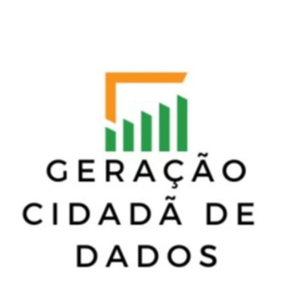

# Repositório de códigos e arquivos da Iniciação Científica "Geração Cidadã de Dados sobre a Baixada Fluminense"

Após os estudos iniciais, a equipe coletou dados em parceria com diversas organizações e utilizou várias tecnologias para analisar e tratar essas informações. Abaixo está uma explicação detalhada das principais ferramentas e tecnologias utilizadas:

### 1. **Folium**
   - **O que é**: Folium é uma biblioteca Python usada para criar mapas interativos.
   - **Como foi utilizado**: Com Folium, a equipe gerou mapas detalhados que permitiram visualizar a distribuição geográfica dos dados coletados. Isso facilitou a identificação de padrões e desigualdades na região da Baixada Fluminense. A biblioteca oferece uma interface simples para integrar camadas de dados e criar visualizações que podem ser manipuladas diretamente no navegador.

### 2. **Flask**
   - **O que é**: Flask é um micro framework web em Python que permite criar aplicações web de forma rápida e flexível.
   - **Como foi utilizado**: A equipe usou Flask para desenvolver o protótipo da plataforma de geração cidadã de dados. Flask serviu como a base para criar uma API (Interface de Programação de Aplicações) que facilita a comunicação entre o front-end (interface do usuário) e o back-end (lógica do servidor e banco de dados). Isso permitiu que os usuários acessassem os dados e visualizações de maneira interativa e em tempo real.

### 3. **JSON (JavaScript Object Notation)**
   - **O que é**: JSON é um formato leve para intercâmbio de dados, fácil de ler e escrever para humanos, e fácil de gerar e processar para máquinas.
   - **Como foi utilizado**: JSON foi utilizado para o armazenamento e troca de dados entre diferentes partes do sistema. Por ser um formato universal, JSON facilitou a integração dos dados coletados com outras ferramentas e plataformas. Por exemplo, os dados poderiam ser transmitidos da API criada em Flask para o front-end, ou serem utilizados para popular os mapas criados com Folium.

### 4. **OpenStreetMap (OSM)**
   - **O que é**: OpenStreetMap é um projeto colaborativo que fornece mapas gratuitos e editáveis, criados e mantidos por uma comunidade global.
   - **Como foi utilizado**: OpenStreetMap foi a base cartográfica utilizada para as visualizações de dados no projeto. A equipe usou OSM como fonte para as camadas de mapas dentro do Folium, garantindo que as visualizações fossem precisas e refletissem a realidade geográfica da Baixada Fluminense. O uso de OSM permitiu que o projeto fosse realizado sem custos, com acesso a mapas detalhados e atualizados.

### Integração das Tecnologias
   - **Fluxo de Trabalho**: Os dados coletados foram armazenados em formatos como JSON, que eram facilmente manipuláveis e integráveis com as outras ferramentas. Usando Flask, a equipe criou uma aplicação web onde os dados podiam ser acessados e visualizados. Folium foi utilizado para criar mapas interativos, sobrepondo os dados tratados sobre as camadas de mapas fornecidas pelo OpenStreetMap.
   - **Resultado Final**: A integração dessas tecnologias resultou em uma plataforma robusta e interativa que permite aos usuários visualizar, explorar e interpretar os dados de maneira intuitiva.

